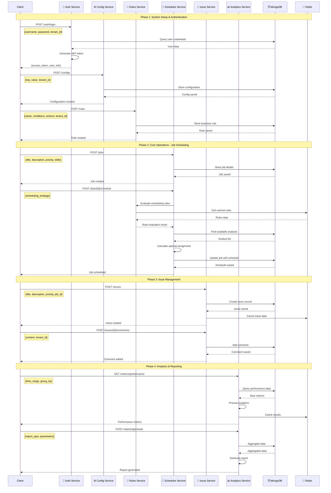
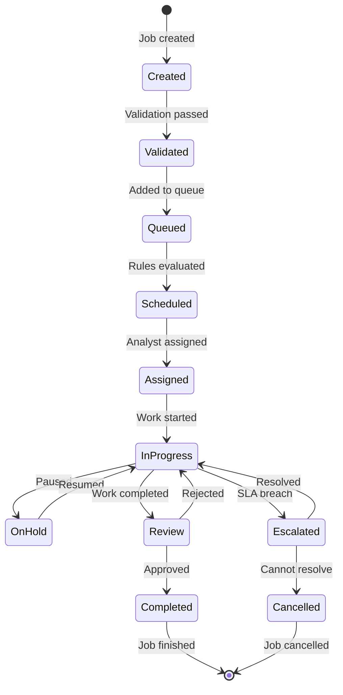
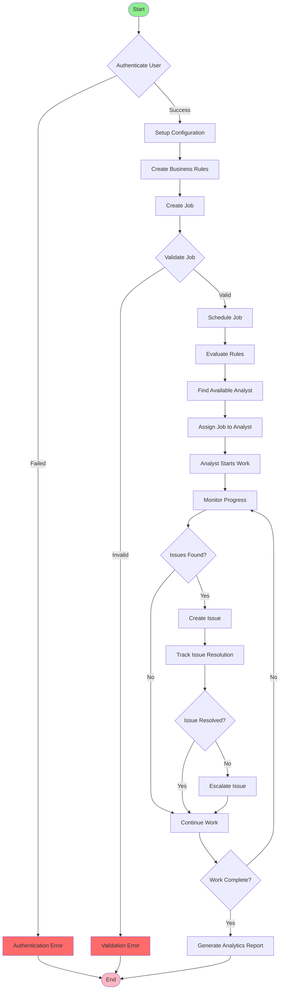
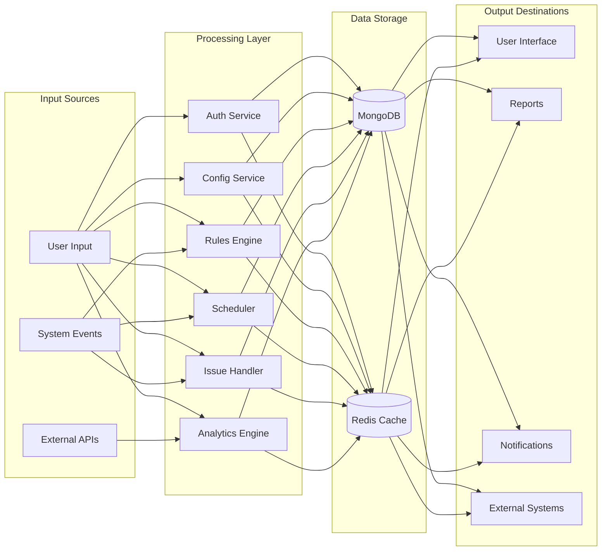
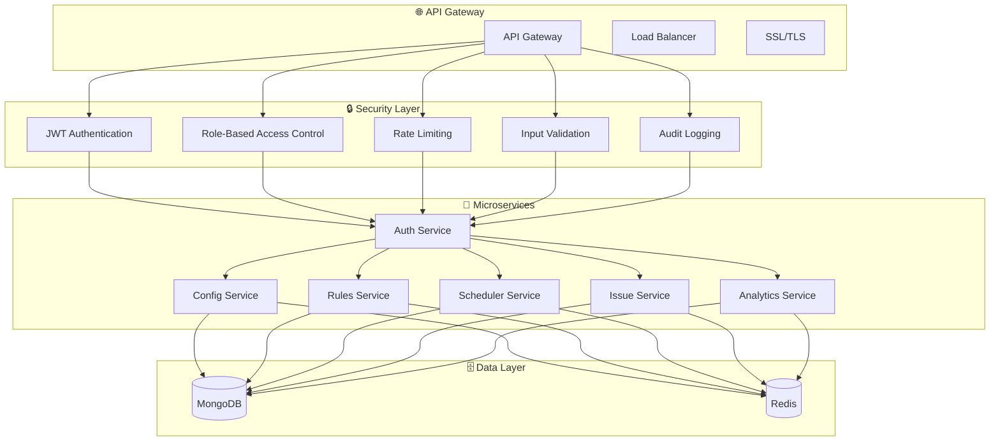

# 🏗️ WFM System UML - End-to-End Flow

## 📋 System Overview

This UML diagram represents the complete end-to-end flow of the Workforce Management (WFM) system, showing all microservices, their interactions, data flow, and the complete user journey from authentication to analytics.

---

## 🔄 Sequence Diagram - Complete End-to-End Flow



---

## 🏗️ Component Diagram - System Architecture

```mermaid
graph TB
    subgraph "🌐 Client Layer"
        WebClient[Web Client]
        MobileClient[Mobile Client]
        APIClient[API Client]
    end
    
    subgraph "🔐 Authentication Layer"
        AuthService[Auth Service<br/>Port: 8000]
        JWT[JWT Token Manager]
        RBAC[Role-Based Access Control]
    end
    
    subgraph "⚙️ Configuration Layer"
        ConfigService[Config Service<br/>Port: 8002]
        ConfigCache[Configuration Cache]
        ConfigValidator[Config Validator]
    end
    
    subgraph "🎯 Rules Engine Layer"
        RulesService[Rules Service<br/>Port: 8001]
        RulesEngine[Rules Engine]
        ConditionEvaluator[Condition Evaluator]
        ActionExecutor[Action Executor]
    end
    
    subgraph "📅 Scheduling Layer"
        SchedulerService[Scheduler Service<br/>Port: 8005]
        JobScheduler[Job Scheduler]
        AnalystManager[Analyst Manager]
        AvailabilityChecker[Availability Checker]
    end
    
    subgraph "🐛 Issue Management Layer"
        IssueService[Issue Service<br/>Port: 8003]
        IssueTracker[Issue Tracker]
        CommentManager[Comment Manager]
        EscalationHandler[Escalation Handler]
    end
    
    subgraph "📊 Analytics Layer"
        AnalyticsService[Analytics Service<br/>Port: 8004]
        MetricsCollector[Metrics Collector]
        ReportGenerator[Report Generator]
        DashboardManager[Dashboard Manager]
    end
    
    subgraph "🗄️ Data Layer"
        MongoDB[(MongoDB<br/>Port: 27018)]
        Redis[(Redis<br/>Port: 6380)]
    end
    
    subgraph "🔄 Communication Layer"
        MessageQueue[Message Queue]
        EventBus[Event Bus]
        ServiceDiscovery[Service Discovery]
    end
    
    %% Client connections
    WebClient --> AuthService
    MobileClient --> AuthService
    APIClient --> AuthService
    
    %% Authentication flow
    AuthService --> JWT
    AuthService --> RBAC
    AuthService --> MongoDB
    
    %% Configuration flow
    ConfigService --> ConfigCache
    ConfigService --> ConfigValidator
    ConfigService --> MongoDB
    ConfigService --> Redis
    
    %% Rules flow
    RulesService --> RulesEngine
    RulesEngine --> ConditionEvaluator
    RulesEngine --> ActionExecutor
    RulesService --> MongoDB
    RulesService --> Redis
    
    %% Scheduling flow
    SchedulerService --> JobScheduler
    SchedulerService --> AnalystManager
    SchedulerService --> AvailabilityChecker
    SchedulerService --> MongoDB
    SchedulerService --> Redis
    
    %% Issue management flow
    IssueService --> IssueTracker
    IssueService --> CommentManager
    IssueService --> EscalationHandler
    IssueService --> MongoDB
    IssueService --> Redis
    
    %% Analytics flow
    AnalyticsService --> MetricsCollector
    AnalyticsService --> ReportGenerator
    AnalyticsService --> DashboardManager
    AnalyticsService --> MongoDB
    AnalyticsService --> Redis
    
    %% Inter-service communication
    SchedulerService --> RulesService
    IssueService --> SchedulerService
    AnalyticsService --> IssueService
    AnalyticsService --> SchedulerService
    
    %% Data layer
    MongoDB --> Redis
    Redis --> MongoDB
    
    %% Communication layer
    MessageQueue --> EventBus
    EventBus --> ServiceDiscovery
```



---

## 📊 Class Diagram - Core Entities

```mermaid
classDiagram
    class User {
        +String id
        +String username
        +String email
        +String tenant_id
        +String status
        +List~String~ role_ids
        +DateTime created_at
        +DateTime updated_at
        +authenticate()
        +has_permission()
    }
    
    class Role {
        +String id
        +String name
        +String description
        +String tenant_id
        +List~String~ permission_ids
        +String status
        +DateTime created_at
        +DateTime updated_at
    }
    
    class Job {
        +String id
        +String title
        +String description
        +String tenant_id
        +String priority
        +String status
        +String assigned_analyst_id
        +DateTime deadline
        +List~String~ required_skills
        +DateTime created_at
        +DateTime updated_at
        +schedule()
        +assign_analyst()
    }
    
    class Analyst {
        +String id
        +String name
        +String email
        +String tenant_id
        +List~String~ skills
        +Integer experience_years
        +Integer max_jobs
        +Dict availability
        +String status
        +DateTime created_at
        +DateTime updated_at
        +is_available()
        +get_workload()
    }
    
    class Issue {
        +String id
        +String title
        +String description
        +String tenant_id
        +String priority
        +String category
        +String assigned_to
        +String reported_by
        +String job_id
        +String status
        +DateTime created_at
        +DateTime updated_at
        +escalate()
        +add_comment()
    }
    
    class Rule {
        +String id
        +String name
        +String description
        +String tenant_id
        +String tag_name
        +Integer sequence
        +Dict conditions
        +List~Dict~ actions
        +String status
        +DateTime created_at
        +DateTime updated_at
        +evaluate()
        +execute_actions()
    }
    
    class Configuration {
        +String id
        +String key
        +Dict value
        +String tenant_id
        +String description
        +String category
        +DateTime created_at
        +DateTime updated_at
        +validate()
        +get_value()
    }
    
    class Report {
        +String id
        +String name
        +String report_type
        +Dict parameters
        +String tenant_id
        +String status
        +DateTime created_at
        +DateTime updated_at
        +generate()
        +export()
    }
    
    %% Relationships
    User ||--o{ Role : has
    User ||--o{ Job : creates
    User ||--o{ Issue : reports
    Analyst ||--o{ Job : assigned_to
    Job ||--o{ Issue : related_to
    Rule ||--o{ Job : affects
    Configuration ||--o{ Job : configures
    Report ||--o{ Job : analyzes
    Report ||--o{ Issue : analyzes
```

---

## 🔄 State Machine Diagram - Job Lifecycle



---

## 🎯 Activity Diagram - Complete Workflow



---

## 📊 Data Flow Diagram



---

## 🔐 Security Architecture Diagram



---

## 📋 Key Features Demonstrated

### ✅ **Authentication & Authorization**
- JWT-based authentication
- Role-based access control
- Multi-tenant isolation
- Secure token management

### ✅ **Configuration Management**
- Dynamic configuration updates
- Tenant-specific settings
- Caching for performance
- Validation and versioning

### ✅ **Rules Engine**
- Business rule evaluation
- Condition-based actions
- Real-time rule processing
- Caching for efficiency

### ✅ **Job Scheduling**
- Intelligent job assignment
- Skill-based matching
- Availability checking
- Workload balancing

### ✅ **Issue Management**
- Issue tracking and resolution
- Comment and attachment support
- SLA monitoring
- Escalation handling

### ✅ **Analytics & Reporting**
- Real-time metrics collection
- Performance analytics
- Custom report generation
- Dashboard visualization

---

## 🚀 System Benefits

1. **Scalability**: Microservices architecture allows independent scaling
2. **Reliability**: Fault isolation and redundancy
3. **Maintainability**: Clear separation of concerns
4. **Security**: Multi-layered security approach
5. **Performance**: Caching and optimization strategies
6. **Flexibility**: Easy to extend and modify

---

**Status: ✅ Complete UML Documentation Created**

The UML diagrams provide a comprehensive view of the WFM system's end-to-end flow, architecture, and interactions between all components. 