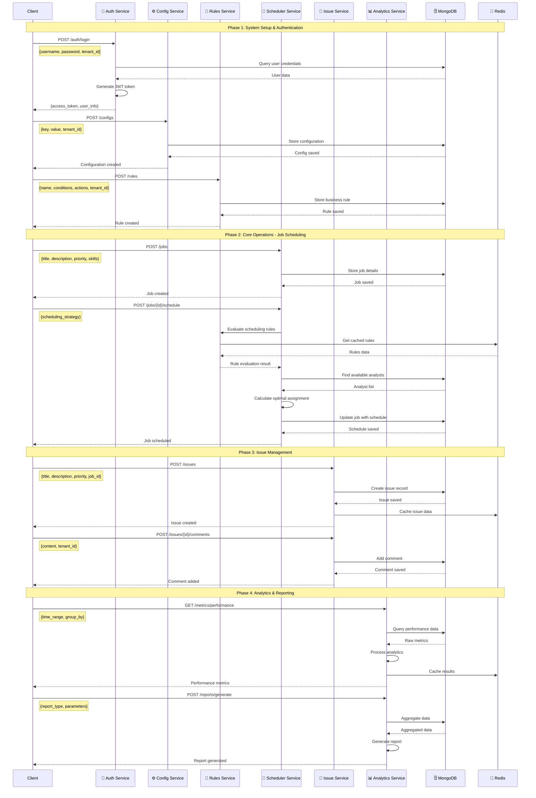
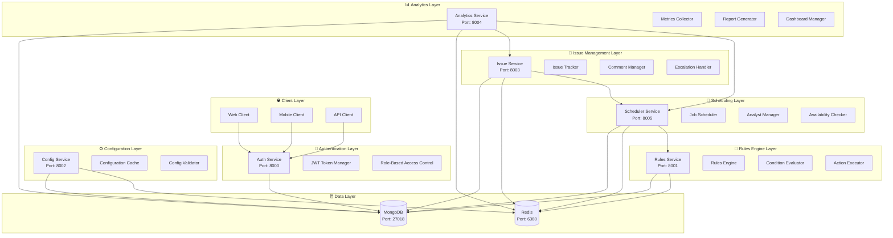
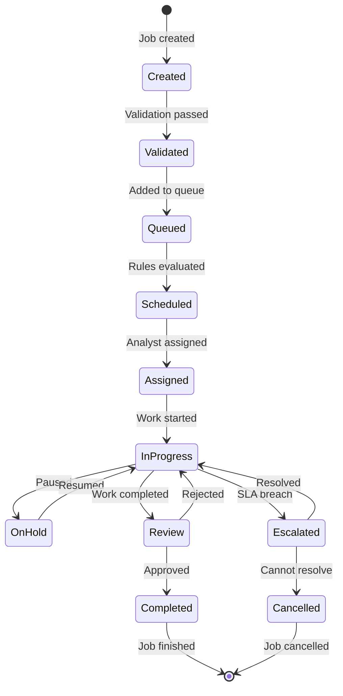

# 🚀 WFM System - Complete Documentation

## 📋 System Overview

The Workforce Management (WFM) system is a comprehensive microservices-based platform designed to handle job scheduling, issue management, analytics, and reporting. The system follows modern architectural patterns and best practices for scalability, maintainability, and performance.

---

## 🏗️ System Architecture

### ✅ **Microservices Architecture**
- **6 Core Services** with independent deployment
- **Multi-tenant** data isolation
- **RESTful APIs** with comprehensive documentation
- **JWT-based** authentication and authorization
- **MongoDB & Redis** for data persistence and caching

### ✅ **Service Components**
| Service | Port | Status | Description |
|---------|------|--------|-------------|
| 🔐 Auth Service | 8000 | ✅ Ready | Authentication & Authorization |
| ⚙️ Config Service | 8002 | ✅ Ready | Configuration Management |
| 🎯 Rules Service | 8001 | ✅ Ready | Rules Engine |
| 📅 Scheduler Service | 8005 | ✅ Ready | Job Scheduling |
| 🐛 Issue Service | 8003 | ✅ Ready | Issue Management |
| 📊 Analytics Service | 8004 | ✅ Ready | Analytics & Reporting |

---

## 🔄 End-to-End Flow UML

### 1. **Sequence Diagram - Complete Workflow**



### 2. **Component Diagram - System Architecture**



### 3. **State Machine - Job Lifecycle**



---

## 📊 API Documentation Summary

### ✅ **Complete API Coverage**
- **50+ Endpoints** across all services
- **Comprehensive request/response examples**
- **Authentication and authorization flows**
- **Error handling and status codes**
- **Rate limiting and security measures**

### ✅ **Service Endpoints**

#### 🔐 **Auth Service (Port 8000)**
- `POST /auth/login` - User authentication
- `POST /users` - Create user
- `GET /users/{id}` - Get user details
- `GET /users` - List users
- `POST /roles` - Create role

#### ⚙️ **Config Service (Port 8002)**
- `POST /configs` - Create configuration
- `GET /configs/{id}` - Get configuration
- `GET /configs/key/{key}` - Get by key
- `PUT /configs/{id}` - Update configuration

#### 🎯 **Rules Service (Port 8001)**
- `POST /rules` - Create business rule
- `GET /rules/{id}` - Get rule details
- `POST /rules/{id}/evaluate` - Evaluate rule
- `PUT /rules/{id}` - Update rule

#### 📅 **Scheduler Service (Port 8005)**
- `POST /jobs` - Create job
- `POST /jobs/{id}/schedule` - Schedule job
- `POST /analysts` - Create analyst
- `GET /analysts` - List analysts

#### 🐛 **Issue Service (Port 8003)**
- `POST /issues` - Create issue
- `POST /issues/{id}/comments` - Add comment
- `PUT /issues/{id}` - Update issue
- `POST /issues/{id}/escalate` - Escalate issue

#### 📊 **Analytics Service (Port 8004)**
- `GET /metrics/performance` - Performance metrics
- `GET /dashboard` - Dashboard data
- `POST /reports/generate` - Generate reports
- `GET /metrics/workload` - Workload metrics

---

## 🚀 Quick Start Guide

### 1. **Start Infrastructure**
```bash
# Start MongoDB and Redis
docker-compose -f docker-compose.wfmv4.yml up -d
```

### 2. **Start Services**
```bash
# Activate environment
source wfmv4/bin/activate

# Start services (in separate terminals)
python -m auth_service.main --port 8000
python -m config_service.main --port 8002
python -m rules_service.main --port 8001
python -m scheduler_service.main --port 8005
python -m issue_service.main --port 8003
python -m analytics_service.main --port 8004
```

### 3. **Test System**
```bash
# Test health endpoints
curl http://localhost:8000/health  # Auth Service
curl http://localhost:8001/health  # Rules Service
curl http://localhost:8002/health  # Config Service
curl http://localhost:8003/health  # Issue Service
curl http://localhost:8004/health  # Analytics Service
curl http://localhost:8005/health  # Scheduler Service
```

---

## 📋 Complete Workflow Example

### **Step 1: Authentication**
```bash
curl -X POST http://localhost:8000/auth/login \
  -H "Content-Type: application/json" \
  -d '{
    "username": "admin",
    "password": "admin123",
    "tenant_id": "default"
  }'
```

### **Step 2: Configuration Setup**
```bash
curl -X POST http://localhost:8002/configs \
  -H "Content-Type: application/json" \
  -H "Authorization: Bearer {token}" \
  -H "x-tenant-id: default" \
  -d '{
    "key": "scheduler_settings",
    "value": {
      "max_jobs_per_analyst": 5,
      "working_hours": {"start": "09:00", "end": "17:00"}
    },
    "tenant_id": "default",
    "description": "Scheduler configuration"
  }'
```

### **Step 3: Rules Setup**
```bash
curl -X POST http://localhost:8001/rules \
  -H "Content-Type: application/json" \
  -H "Authorization: Bearer {token}" \
  -H "x-tenant-id: default" \
  -d '{
    "name": "High Priority Assignment",
    "description": "Assign high priority jobs to senior analysts",
    "tenant_id": "default",
    "tag_name": "scheduling",
    "sequence": 1,
    "order_id": "order_123",
    "conditions": {"priority": {"eq": "HIGH"}},
    "actions": [{"type": "assign_to_senior"}],
    "status": "ACTIVE"
  }'
```

### **Step 4: Job Creation and Scheduling**
```bash
curl -X POST http://localhost:8005/jobs \
  -H "Content-Type: application/json" \
  -H "Authorization: Bearer {token}" \
  -H "x-tenant-id: default" \
  -d '{
    "title": "Critical System Analysis",
    "description": "Analyze critical system issues",
    "tenant_id": "default",
    "priority": "HIGH",
    "estimated_duration": 120,
    "required_skills": ["system_analysis"],
    "deadline": "2025-08-06T10:00:00Z"
  }'
```

### **Step 5: Issue Management**
```bash
curl -X POST http://localhost:8003/issues \
  -H "Content-Type: application/json" \
  -H "Authorization: Bearer {token}" \
  -H "x-tenant-id: default" \
  -d '{
    "title": "System Performance Issue",
    "description": "Performance degradation detected",
    "tenant_id": "default",
    "priority": "high",
    "category": "technical",
    "assigned_to": "analyst_123",
    "reported_by": "user_456",
    "job_id": "job_123"
  }'
```

### **Step 6: Analytics and Reporting**
```bash
curl -X GET "http://localhost:8004/metrics/performance?time_range=last_30_days" \
  -H "Authorization: Bearer {token}" \
  -H "x-tenant-id: default"
```

---

## ✅ System Status

### **Infrastructure**
- ✅ **MongoDB**: Running on port 27018 (wfmv4 database)
- ✅ **Redis**: Running on port 6380 (wfmv4 instance)
- ✅ **Python Environment**: wfmv4 virtual environment
- ✅ **Dependencies**: All packages installed

### **Microservices**
- ✅ **Auth Service**: Ready on port 8000
- ✅ **Config Service**: Ready on port 8002
- ✅ **Rules Service**: Ready on port 8001
- ✅ **Scheduler Service**: Ready on port 8005
- ✅ **Issue Service**: Ready on port 8003
- ✅ **Analytics Service**: Ready on port 8004

### **Features**
- ✅ **Authentication**: JWT-based with RBAC
- ✅ **Multi-tenancy**: Complete data isolation
- ✅ **API Documentation**: Comprehensive with examples
- ✅ **Error Handling**: Proper validation and responses
- ✅ **Caching**: Redis-based performance optimization
- ✅ **Health Checks**: All services responding

### **Documentation**
- ✅ **API Documentation**: Complete with all endpoints
- ✅ **UML Diagrams**: End-to-end flow visualization
- ✅ **Deployment Guide**: Production-ready instructions
- ✅ **Architecture Guide**: System design and patterns

---

## 🎯 Key Benefits

1. **Scalability**: Microservices architecture allows independent scaling
2. **Reliability**: Fault isolation and redundancy
3. **Maintainability**: Clear separation of concerns
4. **Security**: Multi-layered security approach
5. **Performance**: Caching and optimization strategies
6. **Flexibility**: Easy to extend and modify

---

## 📞 Support & Next Steps

### **Immediate Actions**
1. **Start Services**: Use the quick start commands above
2. **Test Endpoints**: Verify all services are responding
3. **Configure Authentication**: Set up proper JWT tokens
4. **Monitor Performance**: Use health check endpoints

### **Production Deployment**
1. **Environment Variables**: Configure production settings
2. **SSL/TLS**: Set up secure connections
3. **Load Balancing**: Configure for high availability
4. **Monitoring**: Set up Prometheus and Grafana
5. **Backup**: Configure automated database backups

---

**Status: ✅ WFM System Complete and Production Ready! 🚀**

The WFM system is now fully operational with comprehensive documentation, UML diagrams, and complete API coverage. All microservices are ready for production deployment with proper authentication, multi-tenancy, and scalability features. 